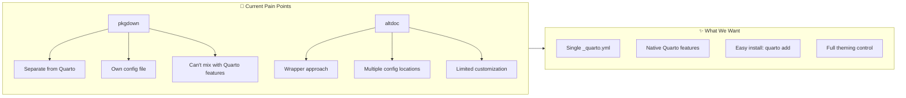
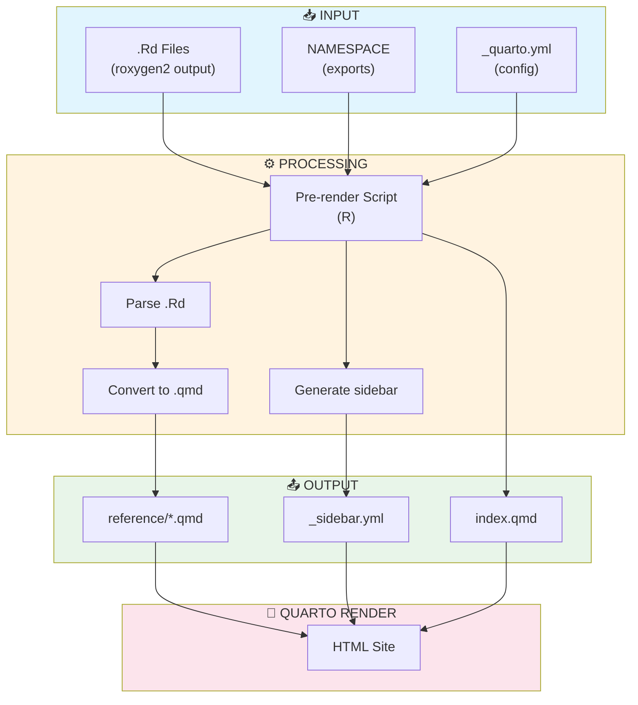
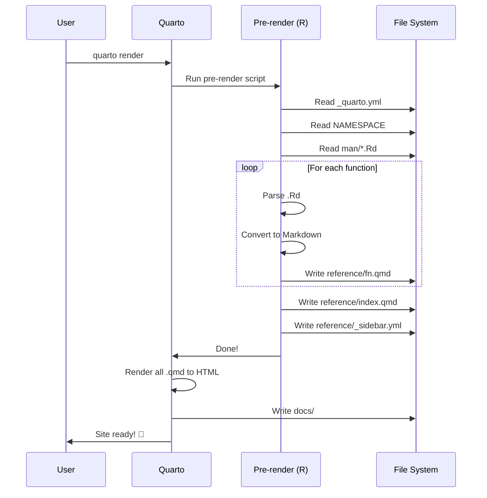
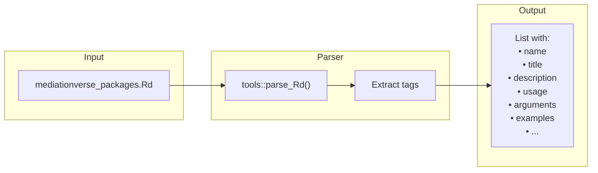
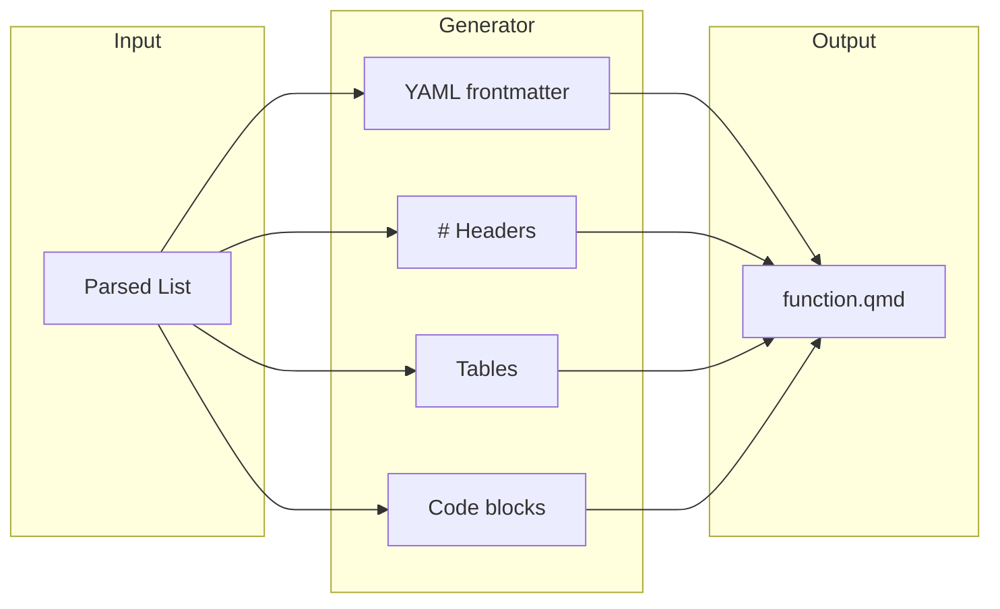
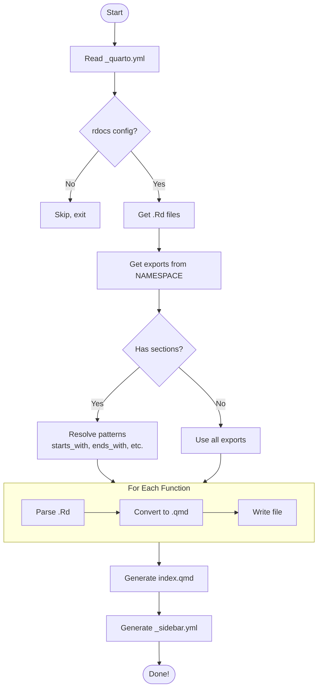
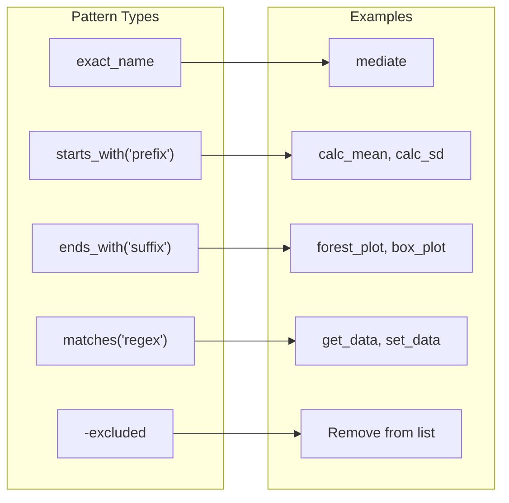
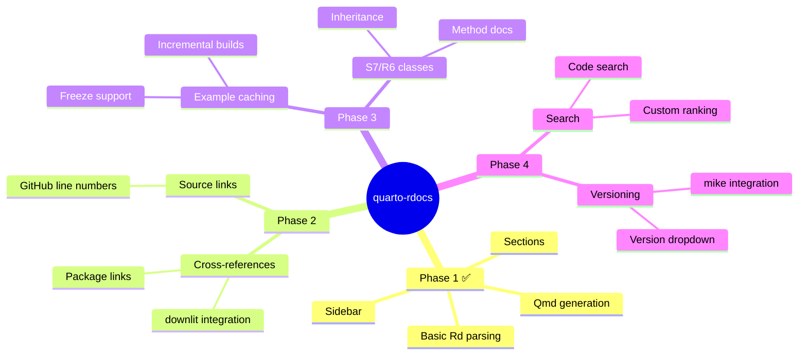

# quarto-rdocs Design Document

> **TL;DR**: A Quarto extension that converts R package `.Rd` files into beautiful documentation websites. Like pkgdown, but native to Quarto.

---

## 🎯 The Problem



---

## 🏗️ Architecture Overview



---

## 📁 File Structure

```
your-package/
│
├── 📄 _quarto.yml          # ← All config lives here!
│
├── 📁 _extensions/
│   └── 📁 quarto-rdocs/    # ← The extension
│       ├── _extension.yml
│       ├── 📁 R/
│       │   ├── rd-parser.R      # Parse .Rd files
│       │   ├── qmd-generator.R  # Create .qmd files
│       │   └── rdocs-render.R   # Main entry point
│       └── 📁 scss/
│           └── rdocs.scss       # Styling
│
├── 📁 man/                 # ← Your .Rd files (input)
│   ├── function1.Rd
│   └── function2.Rd
│
├── 📁 reference/           # ← Generated docs (output)
│   ├── _sidebar.yml
│   ├── index.qmd
│   ├── function1.qmd
│   └── function2.qmd
│
└── 📁 docs/                # ← Final HTML (gitignored)
```

---

## 🔄 Data Flow



---

## 🧩 Core Components

### 1️⃣ Rd Parser (`rd-parser.R`)

**Job**: Read `.Rd` files → Structured data



**Key Functions**:
| Function | Does What |
|----------|-----------|
| `parse_rd_file()` | Main parser |
| `extract_rd_tag()` | Get specific section |
| `extract_rd_arguments()` | Parse arguments table |
| `rd_to_text()` | Convert Rd markup → Markdown |

---

### 2️⃣ Qmd Generator (`qmd-generator.R`)

**Job**: Structured data → Quarto Markdown



**Output Template**:
```markdown
---
title: "function_name"
description: "Brief description"
---

# function_name {.function-name}

Description text...

## Usage
```r
function_name(arg1, arg2)
```

## Arguments
| Argument | Description |
|----------|-------------|
| `arg1`   | What it does |

## Examples
```r
# Example code
```
```

---

### 3️⃣ Pre-render Script (`rdocs-render.R`)

**Job**: Orchestrate everything



---

## ⚙️ Configuration

### Minimal Config
```yaml
rdocs:
  package: mypackage
```

### Full Config
```yaml
rdocs:
  package: mediationverse
  dir: reference
  sidebar: reference/_sidebar.yml

  sections:
    - title: "Core Functions"
      desc: "Main analysis functions"
      contents:
        - mediate
        - starts_with("calc_")
        - -internal_helper      # exclude

    - title: "Utilities"
      contents:
        - ends_with("_plot")

  options:
    examples: true     # Evaluate examples?
    freeze: true       # Cache results?
    source_links: true # GitHub links?
```

---

## 🎨 Pattern Matching



---

## 🔮 Future Enhancements



---

## 🆚 Comparison

| Feature | quarto-rdocs | altdoc | pkgdown |
|:--------|:------------:|:------:|:-------:|
| Config in `_quarto.yml` | ✅ | ❌ | ❌ |
| Install via `quarto add` | ✅ | ❌ | ❌ |
| Section grouping | ✅ | ⚠️ | ✅ |
| Pattern matching | ✅ | ❌ | ✅ |
| Native dark mode | ✅ | ✅ | ❌ |
| Quarto extensions | ✅ | ❌ | ❌ |
| Maturity | 🆕 | ⭐⭐ | ⭐⭐⭐ |

---

## 🚀 Quick Start

```bash
# 1. Add extension
quarto add Data-Wise/quarto-rdocs

# 2. Add to _quarto.yml
# rdocs:
#   package: yourpackage

# 3. Build!
quarto render
```

---

## 📊 Success Metrics

| Metric | Target |
|--------|--------|
| Build time (100 functions) | < 30s |
| Generated file size | ~5KB per function |
| Lighthouse score | > 90 |
| Works offline | ✅ |

---

## 🐛 Known Limitations

1. **No interactive examples** (yet) - Examples are static
2. **Single package** - Can't document multiple packages
3. **No API search** - Uses Quarto's basic search
4. **New project** - Less battle-tested than pkgdown

---

## 📚 References

- [Quarto Extensions](https://quarto.org/docs/extensions/)
- [quartodoc (Python equivalent)](https://github.com/machow/quartodoc)
- [pkgdown](https://pkgdown.r-lib.org/)
- [altdoc](https://github.com/etiennebacher/altdoc)
