# quarto-rdocs Roadmap

> **One-liner**: Build the best R package documentation tool for Quarto.

---

## 🗺️ The Big Picture

---

## ✅ Phase 1: MVP (CURRENT)

**Goal**: Basic working extension

```mermaid
flowchart LR
    subgraph Done["✅ Done"]
        A[Rd Parser]
        B[Qmd Generator]
        C[Pre-render Script]
        D[Basic Styling]
        E[Section Config]
    end

    subgraph Todo["📋 Todo"]
        F[Pattern Matching]
        G[Index Page]
        H[Testing]
    end

    Done --> Todo
```

### Checklist

- [x] Parse `.Rd` files with `tools::parse_Rd()`
- [x] Convert Rd tags to Markdown
- [x] Generate function `.qmd` pages
- [x] Generate sidebar YAML
- [x] Basic SCSS styling
- [x] Section grouping in config
- [ ] `starts_with()` / `ends_with()` patterns
- [ ] Generate `index.qmd` with function table
- [ ] Unit tests

---

## 🔧 Phase 2: Polish

**Goal**: Feature parity with pkgdown basics

### Checklist

- [ ] downlit integration for cross-package links
- [ ] Source code links (GitHub line numbers)
- [ ] Improve dark mode styling
- [ ] Better argument tables
- [ ] Value section formatting
- [ ] See Also section with proper links
- [ ] References/citations formatting

---

## ⚡ Phase 3: Performance

**Goal**: Fast builds for large packages

```mermaid
flowchart LR
    subgraph Current["😴 Current"]
        C1["Full rebuild<br/>every time"]
        C2["Sequential<br/>processing"]
    end

    subgraph Target["🚀 Target"]
        T1["Only changed<br/>files rebuild"]
        T2["Parallel<br/>processing"]
        T3["Cached<br/>examples"]
    end

    Current --> Target

    style Target fill:#e8f5e9
```

### Checklist

- [ ] Freeze support for evaluated examples
- [ ] Incremental builds (hash .Rd files)
- [ ] Parallel processing with `future`
- [ ] Skip unchanged files
- [ ] Build time reporting

### Performance Targets

| Package Size | Current | Target |
|--------------|---------|--------|
| 10 functions | ~5s | ~2s |
| 50 functions | ~25s | ~5s |
| 100 functions | ~50s | ~10s |

---

## 🎓 Phase 4: Advanced

**Goal**: Full-featured documentation platform

### Checklist

- [ ] Version support via mike
- [ ] S7 class documentation
- [ ] R6 class documentation
- [ ] Class inheritance diagrams
- [ ] Custom theme support
- [ ] Multi-package documentation
- [ ] Unified ecosystem search

---

## 🎯 Milestones

---

## 🏆 Success Criteria

### Phase 1 ✓
> Can generate docs for mediationverse

### Phase 2
> Docs look as good as pkgdown

### Phase 3
> Builds are 5x faster than initial

### Phase 4
> Complete replacement for pkgdown

---

## 🤔 Open Questions

1. **Versioning**: Use mike or build our own?
2. **Search**: Quarto native or Algolia/Pagefind?
3. **Multi-package**: Single site or linked sites?
4. **Themes**: Port pkgdown themes or create new?

---

## 📝 Notes

### Why Not Just Use pkgdown?

| Reason | Details |
|--------|---------|
| **Quarto native** | Use all Quarto features (callouts, tabs, etc.) |
| **Single config** | Everything in `_quarto.yml` |
| **Extensible** | Compose with other Quarto extensions |
| **Modern** | Better dark mode, accessibility |

### Why Not Just Use altdoc?

| Reason | Details |
|--------|---------|
| **Simpler config** | No separate `altdoc/` folder |
| **Pattern matching** | pkgdown-style `starts_with()` |
| **Native integration** | Not a wrapper, uses pre-render |

---

## 🔗 Related Resources

- [Quarto Project Types](https://quarto.org/docs/extensions/project-types.html)
- [quartodoc for Python](https://machow.github.io/quartodoc/)
- [pkgdown source](https://github.com/r-lib/pkgdown)
- [altdoc source](https://github.com/etiennebacher/altdoc)
